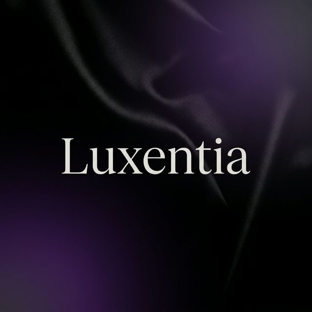

# 💎 LuxeFlow E-commerce



### *Ethereal Atelier: Curated Luxury. Seamless Style.*

**LuxeFlow** is a premium, high-contrast dark-mode e-commerce application designed for the discerning fashion enthusiast. It offers a seamless, sophisticated shopping experience with a focus on minimalism, speed, and visual excellence.

---

## 🌟 Key Features

- **Luxury Onboarding**: A stunning, image-rich 3-page introduction to the LuxeFlow experience.
- **GetX State Management**: High-speed, reactive state management using the GetX ecosystem.
- **AI Concierge**: An integrated intelligent chatbot to assist users with their luxury fashion needs.
- **Secure Authentication**: Robust JWT-based login and signup flow with secure token storage.
- **Dynamic Catalog**: Sophisticated product browsing with sticky category filters and interactive search.
- **Fluid Animations**: Micro-animations and staggered grid layouts for a high-end "living" interface.
- **Full Backend Integration**: Powered by a custom Node.js/Express API with MongoDB persistent storage.

---

## 🛠️ Tech Stack

### 📱 Frontend (Flutter)
- **Framework**: Flutter with GetX
- **Aesthetics**: Glassmorphism, Mesh Gradients, Custom Animations
- **Typography**: Google Fonts (Outfit / Google Fonts Ecosystem)
- **State Management**: GetX (Reactive `Obx`, Controllers, Bindings)
- **Networking**: Dio with interceptors for seamless API communication
- **Storage**: Flutter Secure Storage for persistent sessions

### ⚙️ Backend (Node.js)
- **Runtime**: Node.js v18+
- **Framework**: Express.js
- **Database**: MongoDB (Mongoose ODM)
- **Security**: JWT Authentication, Bcrypt password hashing, CORS
- **Environment**: Dotenv for secure configuration

---

## 📂 Project Structure

```bash
luxeflow_ecommerce/
├── luxeflow_ecommerce_frontend/   # Flutter Application
│   ├── lib/
│   │   ├── features/              # Feature-based architecture (Auth, Cart, Home, etc.)
│   │   └── main.dart              # Entry point
│   ├── assets/                    # Imagery, SVGs, and Localizations
│   └── pubspec.yaml               # Flutter Dependencies
├── luxeflow_ecommerce_backend/    # Node.js Express API
│   ├── src/                       # API Logic, Models, and Controllers
│   ├── index.js                   # Server Entry Point
│   └── .env                       # Environment Variables
└── media/                         # Branding and README assets
```

---

## 🚀 Getting Started

### 1. Prerequisite
- Flutter SDK (Latest Stable)
- Node.js & npm
- MongoDB URI (Atlas or Local)

### 2. Backend Setup
```bash
cd luxeflow_ecommerce_backend
npm install
# Create a .env file with your PORT, MONGODB_URI, and JWT_SECRET
node index.js
```

### 3. Frontend Setup
```bash
cd luxeflow_ecommerce_frontend
flutter pub get
flutter run
```

---

## 🎨 Design Philosophy: "Ethereal Atelier"
LuxeFlow follows a **High-Contrast Dark Mode** aesthetic. The design prioritizes:
- **Depth**: Utilizing glassmorphism and subtle mesh gradients (`mesh_gradient`).
- **Flow**: Staggered animations and smooth screen transitions.
- **Clarity**: Minimalist layouts with high-quality fashion imagery.

---

## 📜 License
This project is licensed under the ISC License.

---

Developed with ❤️ for the future of luxury e-commerce.
